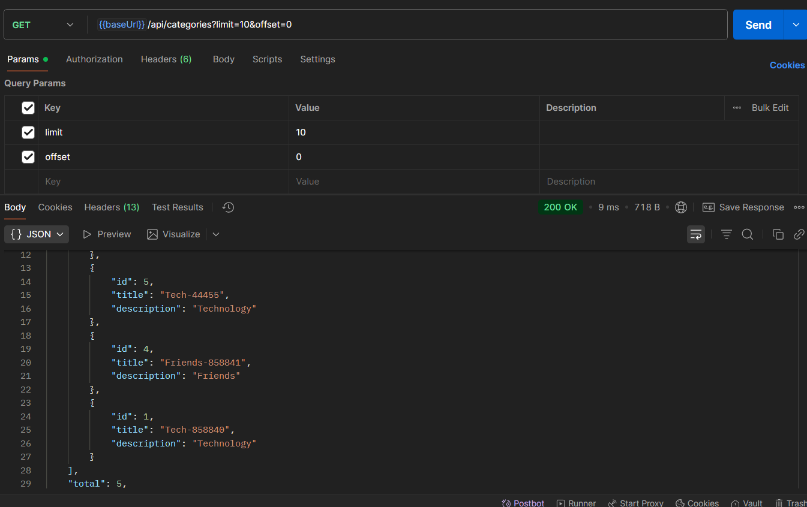

# Usof Backend API

---

## About The Project

**Usof** is a backend service designed to power a community-driven platform for programmers to exchange knowledge. It allows users to post questions, share solutions, comment, and rate content. The core idea is to foster collaboration and create a repository of practical programming knowledge.

This API provides all the necessary functionalities, from user authentication and profile management to content creation and interaction, all governed by a robust role-based access control system.

## Key Features

*   **Authentication**: Secure user registration, login, and session management using JSON Web Tokens (JWT).
*   **Role-Based Access Control (RBAC)**: Clear distinction between `user` and `admin` roles, with specific permissions for each.
*   **User Profiles**: Users can manage their profiles, upload avatars, and track their reputation through an automatically calculated `rating`.
*   **Posts & Categories**: Full CRUD (Create, Read, Update, Delete) functionality for posts, which can be assigned to multiple categories.
*   **Comments**: Users can comment on posts to provide feedback and answers.
*   **Likes/Dislikes**: A rating system for both posts and comments.
*   **Advanced Filtering & Sorting**: All primary resources can be sorted, paginated, and filtered by various criteria (date, likes, category, etc.).
*   **Image Uploads**: Functionality to upload and serve user avatars and images within posts.
*   **Admin Panel**: A simple built-in web interface for administrators to manage users, posts, categories, and comments.

## Built With

This project is built using modern, industry-standard technologies:

*   [Node.js](https://nodejs.org/) - JavaScript runtime environment
*   [Express.js](https://expressjs.com/) - Web application framework for Node.js
*   [MySQL](https://www.mysql.com/) - Relational database
*   [mysql2](https://github.com/sidorares/node-mysql2) - MySQL client for Node.js with focus on performance
*   [JSON Web Token (jsonwebtoken)](https://github.com/auth0/node-jsonwebtoken) - For user authentication
*   [Bcrypt.js](https://github.com/dcodeIO/bcrypt.js) - For password hashing
*   [Multer](https://github.com/expressjs/multer) - Middleware for handling `multipart/form-data` (file uploads)
*   [Dotenv](https://github.com/motdotla/dotenv) - For managing environment variables

## Getting Started

Follow these instructions to get a local copy up and running for development and testing purposes.

### Prerequisites

Make sure you have the following software installed on your machine:
*   **Node.js** (v16 or newer recommended)
*   **npm** (comes with Node.js)
*   **MySQL Server** (v8.0 or newer recommended)

### Installation & Setup

1.  **Clone the repository**
    (Don't forget to replace `your-username` with your actual GitHub username)
    ```sh
    git clone https://github.com/your-username/usof-backend.git
    cd usof-backend
    ```

2.  **Install NPM packages**
    ```sh
    npm install
    ```

3.  **Set up the Database**
    Connect to your MySQL instance and create the database for the project.
    ```sql
    CREATE DATABASE usof_db CHARACTER SET utf8mb4 COLLATE utf8mb4_unicode_ci;
    ```

4.  **Configure Environment Variables**
    Create a `.env` file in the root of the project by making a copy of the `.env.example` file.
    
    On Windows (Command Prompt):
    ```sh
    copy .env.example .env
    ```
    On Linux/macOS/Git Bash:
    ```sh
    cp .env.example .env
    ```
    Now, open the `.env` file and fill in your configuration details, especially for the database connection and JWT secret.
    ```env
    # Server Configuration
    PORT=3000
    HOST=0.0.0.0
    BASE_URL=http://localhost:3000

    # Database Configuration
    DB_HOST=localhost
    DB_PORT=3306
    DB_USER=your_db_user
    DB_PASSWORD=your_db_password
    DB_NAME=usof_db

    # JWT Configuration
    JWT_SECRET=replace-this-with-a-long-random-string
    JWT_EXPIRES_IN=1d

    # File Uploads
    UPLOAD_DIR=src/uploads
    MAX_UPLOAD_SIZE_MB=5

    # Database Initializer (IMPORTANT)
    # Set to 'true' for the very first run to create tables and seed data.
    # Set to 'false' for all subsequent runs.
    INIT_DB=true

    # Enable Swagger/OpenAPI docs at /docs
    SWAGGER_ENABLED=true
    ```

5.  **Initialize the Database and Run the Server**
    For the first run, the `INIT_DB=true` flag will execute the `init.sql` script to create all necessary tables and seed them with initial data.
    ```sh
    node .\src\index.js
    ```
    The server will start, and you will see a log confirming that the DB initialization is complete.

6.  **Subsequent Runs**
    Stop the server (`Ctrl + C`), change `INIT_DB` to `false` in your `.env` file, and restart the server.
    ```sh
    node .\src\index.js
    ```
    Your API is now running at `http://localhost:3000`.

## API Endpoints

The API provides a comprehensive set of endpoints to manage all resources. The base URL for all endpoints is `/api`.

**Example Endpoints:**

*   `POST /api/auth/register` - Register a new user.
*   `POST /api/auth/login` - Log in a user and receive a JWT.
*   `GET /api/posts` - Get a list of all posts (with filtering and pagination).
*   `POST /api/posts` - Create a new post (Authentication required).
*   `GET /api/users/:id` - Get a user's public profile.
*   `PATCH /api/users/me` - Update your own profile (Authentication required).


## Project Structure

The project follows a clean, scalable, and modular architecture to separate concerns.

```/src
├── admin/          # Code for the simple web admin panel
├── config/         # Database, mailer, and environment configuration
├── controllers/    # Express controllers to handle incoming requests
├── db/             # Database initialization script (init.sql)
├── middleware/     # Custom Express middleware (auth, error handling, etc.)
├── repositories/   # Data access layer (raw SQL queries)
├── routes/         # API route definitions
├── services/       # Business logic layer
├── uploads/        # Directory for user-uploaded files (avatars, images)
├── utils/          # Utility functions (JWT, passwords, etc.)
└── validators/     # Request validation schemas


## Screenshots

Here are some examples of testing various API endpoints using Postman.

**User Authentication (Login Endpoint)**


---

**Users API (e.g., Get all users)**


---

**Posts API (e.g., Get all posts)**


---

**Categories API**


---

**Comments API (e.g., Get comments for a post)**


---

**Like/Dislike Functionality**


---

**Running the Node.js Server**
"# Usof_backand" 
